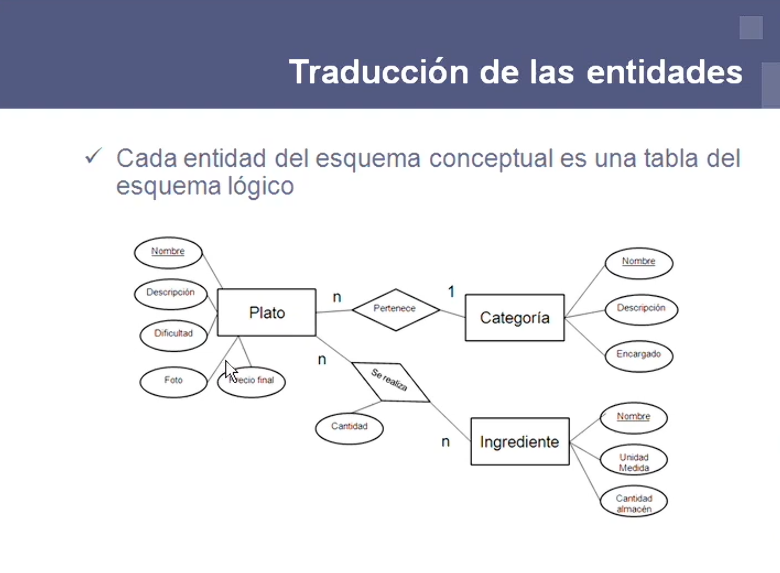

# Apuntes: Diseño Lógico de Bases de Datos Relacionales

El diseño lógico de bases de datos es el paso en el que tomamos todas las necesidades de información que ya habíamos planteado y proponemos una solución tecnológica real. Para lograr esto, necesitamos basarnos en un modelo de datos, que no es más que la tecnología o el formato que usaremos para organizar todo.

En nuestro caso, nos vamos a enfocar en el **modelo relacional**. Es un modelo súper intuitivo porque organiza la información en algo que todos conocemos muy bien: tablas con filas y columnas.

> 

---

## El proceso para pasar de nuestro diagrama a tablas

Si hicimos un buen trabajo previo de análisis y nuestro **Diagrama Entidad-Relación (ER)** está bien hecho, el paso hacia el esquema lógico es un proceso casi automático que sigue unas reglas muy claras.

1. **Entidades a Tablas:** La regla principal es que cada entidad de nuestro diagrama (cada "cuadrito") se transforma en una tabla completamente independiente.
2. **Atributos a Columnas:** Todos los atributos que tenía esa entidad (nombre, descripción, fecha, etc.) pasan a ser las columnas de esa nueva tabla.
3. **Clave Primaria:** El atributo clave de nuestra entidad, ese que la identifica de forma única, se convierte automáticamente en la **Clave Primaria** de la tabla.

---

## ¿Qué hacemos con las relaciones?

La forma en que traducimos las relaciones depende por completo de su **cardinalidad**. No es lo mismo conectar algo de "uno a muchos" que de "muchos a muchos".

### 1. Cuando la relación es de Muchos a Muchos (N:M)
Si tenemos dos entidades que se relacionan de muchos a muchos, creamos una **tabla totalmente nueva** que sirva de puente entre las dos.

* Esta nueva tabla toma prestadas las claves primarias de las dos entidades originales y las usa como sus propias columnas.
* Estas columnas importadas se conocen como **claves ajenas** (foreign keys).
* Juntas, formarán la clave primaria de esta nueva tabla puente.
* Si la relación original tenía atributos propios, también se añaden a esta tabla.

> 

### 2. Cuando la relación es de Uno a Muchos (1:N)
En este caso no necesitamos crear ninguna tabla extra. Lo que hacemos es **modificar la tabla que está del lado de los "muchos"**.

* **Ejemplo:** Si una Categoría tiene muchos Platos, vamos a la tabla de **Platos** y le añadimos una columna nueva.
* Esa columna será la clave primaria de la tabla Categoría.
* Este campo funciona como clave ajena para saber a qué categoría pertenece cada plato.

---

## A modo de conclusión

Si aplicamos este diseño lógico paso a paso, nos aseguramos de que las tablas que vamos a programar concuerden perfectamente con las necesidades iniciales. Seguir esta metodología nos garantiza que la estructura final sea **robusta, profesional y correcta**, evitando el desastre de crear tablas sin un orden lógico.
